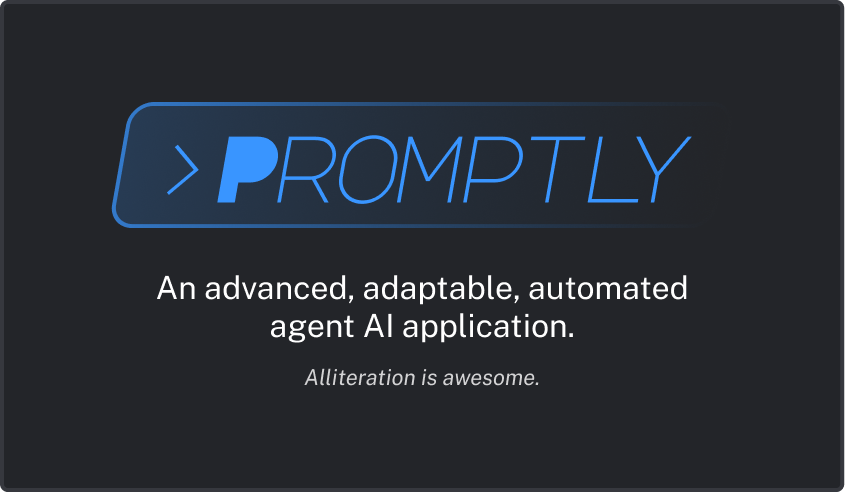

<!-- for a divider line -->
<h1 align="center"></h1>

<!-- shields -->
[![][contributors-shield]][contributors-link]
[![][stars-shield]][stars-link]
[![][issues-shield]][issues-link]
[![][pulls-shield]][pulls-link]

> Promptly is a desktop app for controlling and interacting with AI agents. AI agents can break down tasks, run code, and search the internet to be way more powerful than normal AI chatbots.

## 👨‍💻 Tech Stack

Promptly is built with [Tauri](https://tauri.app/) and [Svelte](https://svelte.dev/), which are in turn powered by Rust and Typescript. For the UI, Promptly also uses [TailwindCSS](https://tailwindcss.com) and [shadcn/svelte](https://www.shadcn-svelte.com/).

## ✍️ Contributing

Contributions to promptly are always greatly appreciated! If you have something in mind, feel free to create an issue or open a pull request at any time.

## ⭐ Spread the word

If you want to support development of Promptly, you can:
- Star the project on GitHub
- Share the project with your friends
- Post about Promptly on your social networks of choice

## License

Promptly is free and open-source software licensed under the GNU General Public License v3.0.
See [LICENSE](https://github.com/gusruben/promptly/blob/main/LICENSE) for more information.

<!-- links -->
[contributors-shield]: https://img.shields.io/github/contributors/gusruben/promptly?style=flat-square&labelColor=%23232529&color=%2326CB54
[contributors-link]: https://github.com/gusruben/promptly/graphs/contributors
[stars-shield]: https://img.shields.io/github/stars/gusruben/promptly?style=flat-square&labelColor=%23232529&color=%23F4EC61
[stars-link]: ttps://github.com/gusruben/promptly/stargazers
[issues-shield]: https://img.shields.io/github/issues/gusruben/promptly?style=flat-square&labelColor=%23232529&color=%23D73636
[issues-link]: https://github.com/gusruben/promptly/issues
[pulls-shield]: https://img.shields.io/github/issues-pr/gusruben/promptly?style=flat-square&labelColor=%23232529&color=%233995FF
[pulls-link]: https://github.com/gusruben/promptly/pulls
